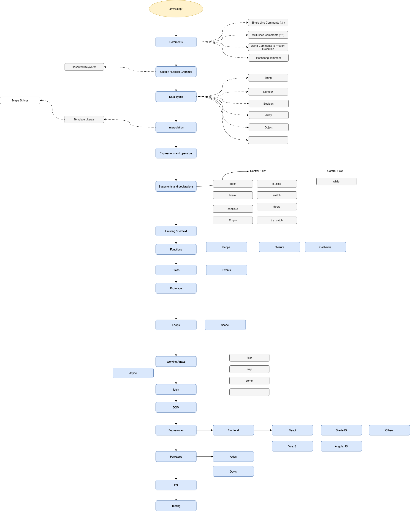

# Curso de JavaScript ~ Roadmap

## Requirements

Have knowledge of programming fundamentals

## Tópicos

## Intro

## Comments

- Single Line Comments
- Multi Lines Comments
- Using Comments to Prevent Execution
- Hashbang Comment

## Sintaxis / Lexical Grammar

- Reserved keywords

## Data Types
- String
- Number
- Boolean
- Array
- Object
- null
- undefined

## Interpolation 

- Template Literals
    - Scape Strings

## Expressions and operators

- 

## [Statements and declarations](https://developer.mozilla.org/en-US/docs/Web/JavaScript/Reference/Statements)

### Control Flow
- Block
- if...else
- break
- continue
- Empty
- switch
- throw
- try...catch

### Declarations

- var
- let
- const

### Functions and classes

- function 
- function*
- async function
- return
- class

### Iterations / Loops
- do...while
- for
- for...in
- for...of
- for await...of
- while

## Hoisting / Context

- 

## Functions

- Scope
- Closure
- Callbacks

## Class

- Events

## Prototype

- 

## DOM

- 

## fetch

- 

## Asynchronous programming

- async...await
- Promises
    - Promises.all

## Testing

- 

## ES

- 

## Frameworks

List of some frameworks on JavaScript

### Frontend
- [Angular](https://angularjs.org/)
- [Ember](https://emberjs.com/)
- [React](https://reactjs.org/)
- [Svelte](https://svelte.dev/)
- [Vue](https://vuejs.org/)

### Backend

- [Express](https://expressjs.com/es/)
- [Nest](https://nestjs.com/)
- [Orion](https://orionjs.com/)
- [Adonis](https://adonisjs.com/)
- [Meteor](https://www.meteor.com/)
- [Koa](https://koajs.com/)
- [Salis](https://sailsjs.com/)

## Packages

list of some libraries for JavaScript

- [axios](https://axios-http.com/)
- [dayjs](https://day.js.org/)
- [lodash](https://lodash.com/)
- 3D
    - [threeJS](https://threejs.org/)
    - [D3.js](https://d3js.org/)

## 

- 

## Roadmap de prueba en una imagen

